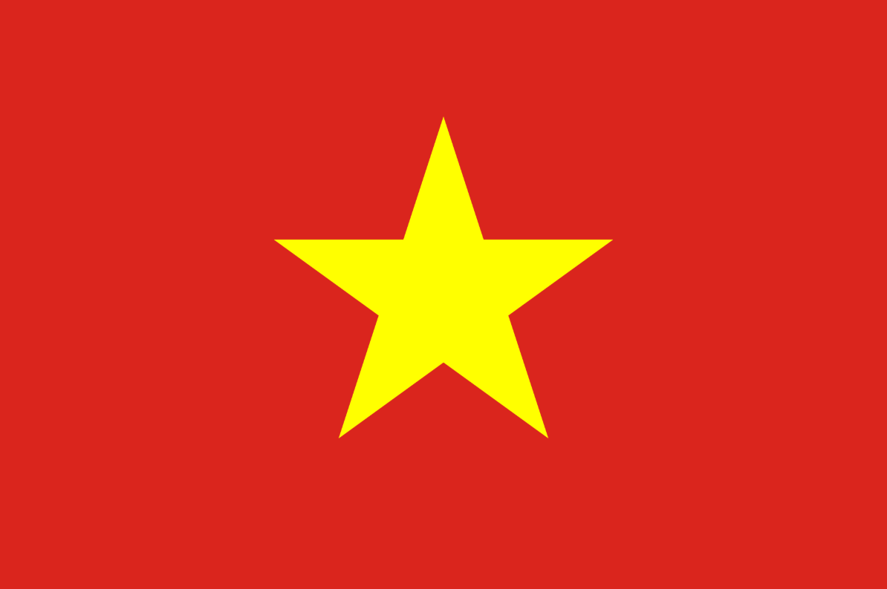
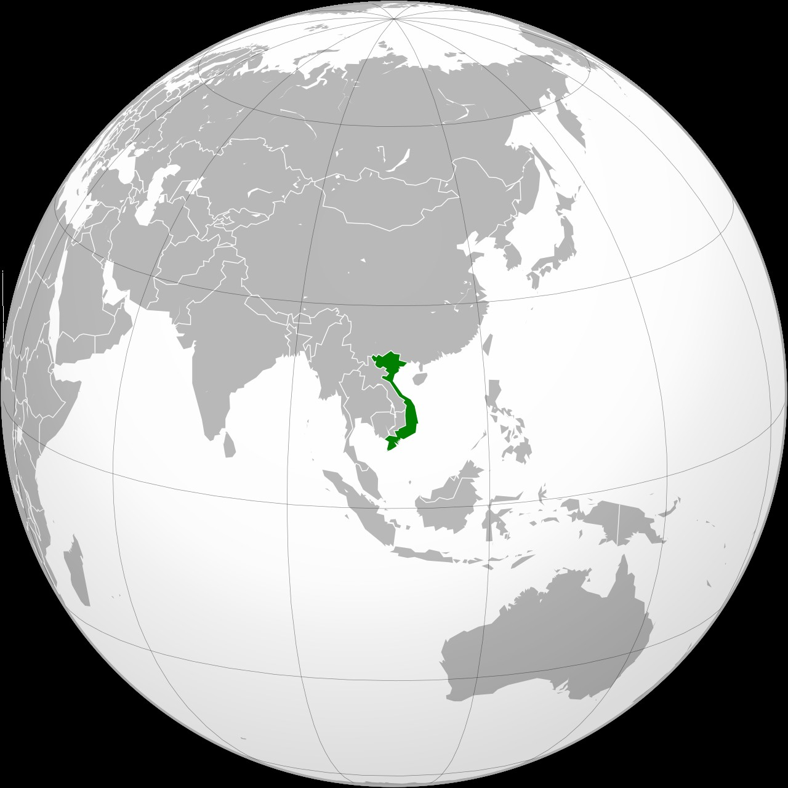

# Welcome to Việt Nam 

Envie d'en savoir plus sur ce beau pays ? Alors vous êtes au bon endroit !

**En fait bref**
  

Le Vietnam ou Viet Nam ou Viêt Nam, ou encore république socialiste du Vietnam en forme longue, (en vietnamien : Việt Nam ou Cộng hòa Xã hội chủ nghĩa Việt Nam) est un pays d'Asie du Sud-Est situé dans l'est de la péninsule indochinoise. Constitué d'une longue côte maritime qui s'étend sur près de 3 260 kilomètres, le Vietnam est bordé par le golfe du Tonkin au nord, la mer de Chine méridionale à l'est et le golfe de Thaïlande au sud-ouest et partage ses frontières avec la Chine au nord, le Laos au nord-ouest et le Cambodge au sud-ouest. Sa capitale est Hanoï, tandis que sa municipalité la plus peuplée est Hô Chi Minh Ville (anciennement Saïgon). La langue officielle est le vietnamien, et la monnaie, le dong. C'est un État communiste à parti unique (Parti communiste vietnamien) où existe la liberté d'entreprendre. D'autres partis siègent à l'Assemblée nationale, mais lui sont étroitement affiliés.

Je viens de mettre les pieds au Viet Nam, que devrais-je faire ? 🤔

[Manger, bien sûr !](pages/pagedeux.md) 

[Découvrir du pays, évidemment !](pages/pagetrois.md)
